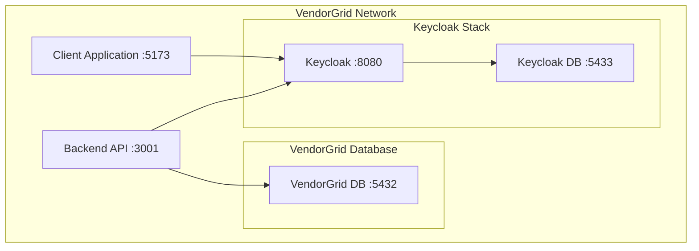

# Keycloak Infrastructure Setup Guide

## Overview

This document provides comprehensive setup and configuration instructions for the Keycloak authentication infrastructure as part of VendorGrid's Replit authentication migration (Phase 2).

## Table of Contents

1. [Prerequisites](#prerequisites)
2. [Keycloak Infrastructure Overview](#keycloak-infrastructure-overview)
3. [Starting Keycloak Services](#starting-keycloak-services)
4. [Admin Console Configuration](#admin-console-configuration)
5. [Realm and Client Setup](#realm-and-client-setup)
6. [Environment Variables Integration](#environment-variables-integration)
7. [Testing and Validation](#testing-and-validation)
8. [Phase 3 Migration Integration](#phase-3-migration-integration)
9. [Troubleshooting](#troubleshooting)
10. [Security Considerations](#security-considerations)

## Prerequisites

- Docker and Docker Compose installed
- Ports 8080, 5432, and 5433 available
- Basic understanding of OIDC (OpenID Connect)
- Access to VendorGrid project files

## Keycloak Infrastructure Overview

The Keycloak setup includes:

- **Keycloak Server**: Identity and Access Management (IAM) service
- **Keycloak Database**: PostgreSQL for persistence
- **VendorGrid Database**: Existing PostgreSQL for application data
- **Admin Console**: Web-based management interface
- **Realm Configuration**: Pre-configured "vendorgrid" realm

### Service Architecture



## Starting Keycloak Services

### 1. Start All Services

```bash
# Start Keycloak and database services
docker-compose up -d keycloak keycloak-postgres

# Verify services are running
docker-compose ps
```

Expected output:
```
NAME                    IMAGE                                   COMMAND                  SERVICE             STATUS              PORTS
keycloak                quay.io/keycloak/keycloak:24.0.1        "/opt/keycloak/bin/k…"   keycloak            running             0.0.0.0:8080->8080/tcp
keycloak-postgres       postgres:16                             "docker-entrypoint.s…"   keycloak-postgres   running             0.0.0.0:5433->5432/tcp
vendorgrid-postgres     postgres:16                             "docker-entrypoint.s…"   postgres            running             0.0.0.0:5432->5432/tcp
```

### 2. Monitor Startup Logs

```bash
# Check Keycloak startup logs
docker logs keycloak -f

# Keycloak is ready when you see:
# "Running the server in development mode. DO NOT use this configuration in production."
```

### 3. Verify Health Status

```bash
# Test Keycloak health endpoint
curl -f http://localhost:8080/realms/master

# Test admin console access
curl -f http://localhost:8080/admin
```

## Admin Console Configuration

### 1. Access Admin Console

- **URL**: http://localhost:8080/admin
- **Username**: admin
- **Password**: admin123 (from environment variables)

### 2. Initial Setup

1. Login to the admin console
2. Review the master realm configuration
3. Ensure admin user has proper permissions

### 3. Create Master Realm (if needed)

```bash
# Alternative: Create master realm via API
curl -X POST http://localhost:8080/admin/realms \
  -H "Authorization: Bearer $ADMIN_TOKEN" \
  -H "Content-Type: application/json" \
  -d @keycloak-init/realm-export.json
```

## Realm and Client Setup

### 1. Import Realm Configuration

#### Option A: Manual Import (Recommended)

1. **In Admin Console**:
   - Select "Master" realm
   - Go to "Realm Settings"
   - Click "Import" under "Realm Settings"
   - Select `keycloak-init/realm-export.json`
   - Review and confirm import

#### Option B: Programmatic Import

```bash
# First, get admin access token
ADMIN_TOKEN=$(curl -X POST http://localhost:8080/realms/master/protocol/openid-connect/token \
  -H "Content-Type: application/x-www-form-urlencoded" \
  -d "grant_type=password&client_id=admin-cli&username=admin&password=admin123" | \
  jq -r '.access_token')

# Import realm
curl -X POST http://localhost:8080/admin/realms \
  -H "Authorization: Bearer $ADMIN_TOKEN" \
  -H "Content-Type: application/json" \
  -d @keycloak-init/realm-export.json
```

### 2. Configure Clients

#### A. Generate Client Secrets

1. **For vendorgrid-app client**:
   - Navigate to: Clients → vendorgrid-app → Credentials
   - Click "Regenerate Secret"
   - Copy the new secret

2. **For vendorgrid-admin client**:
   - Navigate to: Clients → vendorgrid-admin → Credentials  
   - Click "Regenerate Secret"
   - Copy the new secret

#### B. Update Environment Variables

Replace the placeholder secrets in `.env`:

```env
KEYCLOAK_CLIENT_SECRET=your_actual_client_secret_here
KEYCLOAK_ADMIN_CLIENT_SECRET=your_actual_admin_client_secret_here
```

### 3. Client Configuration Verification

#### Check Client Settings

1. **vendorgrid-app**:
   - Client type: OpenID Connect
   - Access type: Confidential
   - Service accounts enabled: Yes
   - Standard flow enabled: Yes
   - Direct access grants enabled: No

2. **Redirect URIs**:
   ```
   http://localhost:5173/*
   http://localhost:3001/*
   ```

3. **Web Origins**:
   ```
   http://localhost:5173
   http://localhost:3001
   ```

#### Test Client Configuration

```bash
# Test client configuration
curl -X POST http://localhost:8080/realms/vendorgrid/protocol/openid-connect/token \
  -H "Content-Type: application/x-www-form-urlencoded" \
  -d "grant_type=client_credentials&client_id=vendorgrid-app&client_secret=YOUR_CLIENT_SECRET"
```

## Environment Variables Integration

### 1. Required Variables

The `.env` file contains all necessary Keycloak configuration:

```env
# Keycloak Server
KEYCLOAK_BASE_URL=http://localhost:8080
KEYCLOAK_REALM=vendorgrid
KEYCLOAK_CLIENT_ID=vendorgrid-app
KEYCLOAK_CLIENT_SECRET=REPLACE_WITH_GENERATED_SECRET

# Authentication Endpoints
KEYCLOAK_AUTH_URL=http://localhost:8080/realms/vendorgrid
KEYCLOAK_TOKEN_URL=http://localhost:8080/realms/vendorgrid/protocol/openid-connect/token
KEYCLOAK_USERINFO_URL=http://localhost:8080/realms/vendorgrid/protocol/openid-connect/userinfo
```

### 2. Dual Authentication Support

**Phase 2 Configuration**:
- `AUTH_PROVIDER=replit` (maintains existing Replit authentication)
- Keycloak is fully functional but not actively used

**Phase 3 Migration**:
- Change `AUTH_PROVIDER=keycloak` to activate Keycloak
- Gradual migration plan for user accounts

## Testing and Validation

### 1. Service Health Checks

```bash
# Test Keycloak availability
curl -f http://localhost:8080/realms/master
curl -f http://localhost:8080/realms/vendorgrid

# Test admin console
curl -f http://localhost:8080/admin
```

### 2. Database Connectivity

```bash
# Test Keycloak database connection
docker exec keycloak-postgres psql -U keycloak_user -d keycloak -c "SELECT version();"
```

### 3. Client Configuration Test

```bash
# Test OpenID Connect discovery
curl -f http://localhost:8080/realms/vendorgrid/.well-known/openid_configuration

# Test token endpoint
curl -X POST http://localhost:8080/realms/vendorgrid/protocol/openid-connect/token \
  -H "Content-Type: application/x-www-form-urlencoded" \
  -d "grant_type=client_credentials&client_id=vendorgrid-app&client_secret=YOUR_SECRET"
```

### 4. User Management Test

1. **Create Test User**:
   - Admin Console → Users → Create New User
   - Set username: `testuser`
   - Set email: `testuser@example.com`
   - Set temporary password: `false`

2. **Set User Password**:
   - Navigate to test user
   - Credentials tab → Create credentials
   - Password: `testpass123`
   - Temporary: `false`

3. **Test Login Flow**:
   - URL: http://localhost:8080/realms/vendorgrid/account
   - Login with test user credentials
   - Verify access to user account page

## Phase 3 Migration Integration

### 1. Integration Points

The Keycloak setup provides the following integration endpoints for Phase 3:

#### OpenID Connect Discovery
```
http://localhost:8080/realms/vendorgrid/.well-known/openid_configuration
```

#### OAuth2 Token Endpoints
```
Token: http://localhost:8080/realms/vendorgrid/protocol/openid-connect/token
UserInfo: http://localhost:8080/realms/vendorgrid/protocol/openid-connect/userinfo
```

#### JWKS (JSON Web Key Set)
```
http://localhost:8080/realms/vendorgrid/protocol/openid-connect/certs
```

### 2. Frontend Integration Ready

**Current** (Phase 2):
- Frontend uses Replit OIDC
- Keycloak exists but inactive
- Both systems run in parallel

**Phase 3 Migration Steps**:
1. Update `AUTH_PROVIDER=keycloak` in `.env`
2. Update OIDC client configuration to point to Keycloak
3. Test authentication flow
4. Migrate existing user accounts
5. Remove Replit dependencies

### 3. Backend Integration Points

The backend server (server/replitAuth.ts) will need updates for Phase 3:

```typescript
// Phase 3: Update authentication provider
const AUTH_PROVIDER = process.env.AUTH_PROVIDER || 'replit';

if (AUTH_PROVIDER === 'keycloak') {
  // Use Keycloak OIDC configuration
  const keycloakConfig = {
    clientId: process.env.KEYCLOAK_CLIENT_ID,
    clientSecret: process.env.KEYCLOAK_CLIENT_SECRET,
    authUrl: process.env.KEYCLOAK_AUTH_URL,
    tokenUrl: process.env.KEYCLOAK_TOKEN_URL,
    userInfoUrl: process.env.KEYCLOAK_USERINFO_URL
  };
} else {
  // Continue using Replit OIDC
  // Existing replitAuth.ts implementation
}
```

### 4. Migration Checklist

- [ ] Keycloak infrastructure running and healthy
- [ ] Realm and clients configured
- [ ] Client secrets generated and documented
- [ ] Environment variables updated
- [ ] User management interface functional
- [ ] Integration endpoints tested
- [ ] Documentation complete
- [ ] Ready for Phase 3 migration testing

## Troubleshooting

### Common Issues

#### 1. Keycloak Won't Start

**Symptoms**: Container exits immediately or health check fails

**Solutions**:
```bash
# Check logs
docker logs keycloak

# Verify database connection
docker logs keycloak-postgres

# Restart services
docker-compose restart keycloak keycloak-postgres

# Check port conflicts
netstat -tulpn | grep :8080
```

#### 2. Database Connection Issues

**Symptoms**: Keycloak can't connect to database

**Solutions**:
```bash
# Test database connectivity
docker exec keycloak-postgres pg_isready -U keycloak_user -d keycloak

# Check database logs
docker logs keycloak-postgres

# Reset database volume
docker-compose down -v
docker-compose up -d keycloak-postgres
```

#### 3. Admin Console Access Issues

**Symptoms**: Cannot login to admin console

**Solutions**:
```bash
# Check admin credentials
docker exec keycloak env | grep KEYCLOAK_ADMIN

# Reset admin password
docker exec keycloak /opt/keycloak/bin/kc.sh set-password \
  --user admin --new-password admin123

# Alternative: Create new admin user
docker exec keycloak /opt/keycloak/bin/kc.sh create-admin-user \
  --username newadmin --password newpass123
```

#### 4. Client Configuration Issues

**Symptoms**: Token exchange fails, redirect URI mismatches

**Solutions**:
- Verify client secret matches environment variables
- Check redirect URIs include correct localhost ports
- Ensure CORS settings allow frontend origin
- Regenerate client secret if needed

#### 5. Port Conflicts

**Symptoms**: Docker ports already in use

**Solutions**:
```bash
# Find process using port 8080
lsof -i :8080

# Find process using port 5433
lsof -i :5433

# Stop conflicting services or change ports in docker-compose.yml
```

### Performance Issues

#### Slow Startup
```bash
# Increase Java heap size
docker-compose exec keycloak java -Xmx1024m -jar /opt/keycloak/quarkus/keycloak.jar
```

#### Memory Usage
```yaml
# In docker-compose.yml, add memory limits
services:
  keycloak:
    mem_limit: 2g
    mem_reservation: 1g
```

## Security Considerations

### 1. Production Hardening

**Before Production Deployment**:
- Change all default passwords
- Enable HTTPS/TLS
- Configure proper firewall rules
- Implement rate limiting
- Enable audit logging
- Review and restrict CORS policies

### 2. Database Security

```yaml
# Use stronger database passwords
KEYCLOAK_POSTGRES_PASSWORD: strong_random_password
VENDORGRID_POSTGRES_PASSWORD: strong_random_password
```

### 3. Keycloak Security

- Enable security features in production mode
- Configure proper session timeouts
- Implement proper role-based access control
- Enable password policies
- Configure email verification

### 4. Client Security

- Use confidential client types
- Rotate client secrets regularly
- Implement proper redirect URI validation
- Enable PKCE for public clients

## Monitoring and Maintenance

### 1. Health Monitoring

```bash
# Create health check script
#!/bin/bash
KEYCLOAK_URL="http://localhost:8080/realms/vendorgrid"
if curl -f $KEYCLOAK_URL; then
  echo "Keycloak is healthy"
  exit 0
else
  echo "Keycloak is down"
  exit 1
fi
```

### 2. Log Monitoring

```bash
# Monitor Keycloak logs
docker logs -f keycloak | grep ERROR

# Monitor database logs  
docker logs -f keycloak-postgres | grep ERROR
```

### 3. Backup Strategy

```bash
# Backup Keycloak database
docker exec keycloak-postgres pg_dump -U keycloak_user keycloak > keycloak_backup.sql

# Backup Keycloak configuration
docker exec keycloak tar -czf /opt/keycloak-backup.tar.gz /opt/keycloak/data
```

### 4. Update Process

```bash
# Update Keycloak to latest version
docker-compose pull keycloak
docker-compose up -d keycloak
```

## Integration Examples

### Frontend OIDC Configuration (Phase 3 Ready)

```typescript
// Phase 3: Frontend OIDC configuration
const oidcConfig = {
  authority: 'http://localhost:8080/realms/vendorgrid',
  client_id: 'vendorgrid-app',
  redirect_uri: 'http://localhost:5173/auth/callback',
  response_type: 'code',
  scope: 'openid profile email',
  loadUserInfo: true,
  automaticSilentRenew: true,
  silent_redirect_uri: 'http://localhost:5173/auth/silent-callback'
};
```

### Backend OIDC Integration (Phase 3 Ready)

```typescript
// Phase 3: Backend OIDC verification
const verifyToken = async (token: string) => {
  const jwksUrl = 'http://localhost:8080/realms/vendorgrid/protocol/openid-connect/certs';
  const issuer = 'http://localhost:8080/realms/vendorgrid';
  
  // Verify JWT token using JWKS
  const verified = await verifyJWT(token, jwksUrl, issuer);
  return verified;
};
```

## Support and Resources

### Official Documentation
- [Keycloak Documentation](https://www.keycloak.org/documentation)
- [Keycloak Docker Guide](https://www.keycloak.org/server/containers)
- [Keycloak Admin API](https://www.keycloak.org/docs-api/)

### Community Resources
- [Keycloak GitHub](https://github.com/keycloak/keycloak)
- [Keycloak Forums](https://keycloak.discourse.group/)
- [Stack Overflow Keycloak Tag](https://stackoverflow.com/questions/tagged/keycloak)

### VendorGrid Specific
- [Project README](../README.md)
- [Phase 3 Migration Plan](TODO-phase3-migration.md)
- [API Documentation](../docs/api-documentation.md)

---

**Status**: Phase 2 Complete ✅  
**Last Updated**: 2025-11-11  
**Next Phase**: Phase 3 - Authentication Migration  
**Version**: 1.0