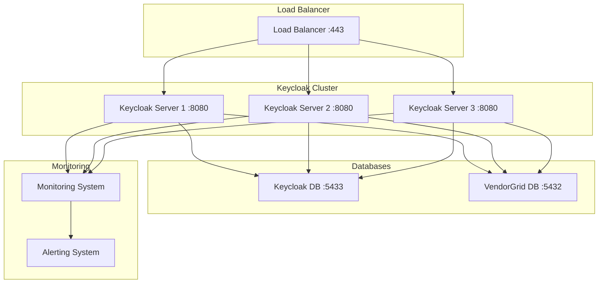

# 🔧 VendorGrid Administrator Guide
## Keycloak Authentication System Administration

**Document Version:** 1.0  
**Date:** November 11, 2025  
**Target Audience:** System Administrators, IT Staff, Security Team  
**Scope:** Production Environment Management

---

## Table of Contents

1. [Administrator Overview](#administrator-overview)
2. [Keycloak System Architecture](#keycloak-system-architecture)
3. [Initial Setup and Configuration](#initial-setup-and-configuration)
4. [User Management](#user-management)
5. [Security Configuration](#security-configuration)
6. [System Administration Tasks](#system-administration-tasks)
7. [Monitoring and Maintenance](#monitoring-and-maintenance)
8. [Incident Response Procedures](#incident-response-procedures)
9. [Troubleshooting Guide](#troubleshooting-guide)
10. [Backup and Recovery](#backup-and-recovery)
11. [Performance Optimization](#performance-optimization)
12. [Compliance and Audit](#compliance-and-audit)

---

## Administrator Overview

### Purpose and Scope

This guide provides comprehensive instructions for administering the new Keycloak-based authentication system that powers VendorGrid. Administrators are responsible for ensuring the security, reliability, and optimal performance of the authentication infrastructure.

### Administrator Responsibilities

#### Primary Responsibilities
- **User Account Management:** Creating, modifying, and deactivating user accounts
- **Security Configuration:** Managing authentication policies, password rules, and security settings
- **System Monitoring:** Monitoring system health, performance, and security events
- **Incident Response:** Responding to security incidents and system issues
- **Compliance Management:** Ensuring adherence to security policies and regulations
- **Backup and Recovery:** Managing system backups and disaster recovery procedures

#### Daily Tasks
- Monitor authentication success/failure rates
- Review security logs and alerts
- Manage user requests and account changes
- Perform routine system health checks
- Update security policies as needed

#### Weekly Tasks
- Review system performance metrics
- Analyze authentication trends and patterns
- Update user access reviews
- Perform security assessments
- Review and update documentation

#### Monthly Tasks
- Conduct security audits
- Review and update security policies
- Perform disaster recovery testing
- Review system capacity and performance
- Update administrator training

### Required Access and Permissions

#### Keycloak Admin Console Access
- **URL:** http://localhost:8080/admin (development/production as applicable)
- **Username:** admin
- **Password:** [Configured in environment variables]
- **Permissions:** Full administrative access to Keycloak realm

#### VendorGrid Admin Panel
- **URL:** https://vendorgrid.com/admin
- **Admin Account:** Administrative access to user management
- **Permissions:** User management, system configuration, reporting

#### System Access
- **Server Access:** SSH/keyboard access to authentication servers
- **Database Access:** Admin access to authentication database
- **Monitoring Tools:** Access to monitoring and alerting systems
- **Backup Systems:** Access to backup and recovery systems

---

## Keycloak System Architecture

### System Components

#### Keycloak Server
- **Role:** Central identity and access management (IAM) service
- **Port:** 8080 (HTTP) / 8443 (HTTPS in production)
- **Configuration:** /opt/keycloak configuration directory
- **Database:** PostgreSQL database for user and realm data

#### Keycloak Database
- **Database Type:** PostgreSQL 16
- **Port:** 5433
- **Database Name:** keycloak
- **User:** keycloak_user
- **Purpose:** Store all Keycloak configuration and user data

#### VendorGrid Database
- **Database Type:** PostgreSQL 16
- **Port:** 5432
- **Database Name:** vendorgrid
- **Purpose:** Store application-specific user data and business logic

#### Load Balancer (Production)
- **Role:** Distribute authentication requests
- **Health Checks:** Monitor Keycloak server availability
- **SSL Termination:** Handle HTTPS connections

### Service Architecture



### Authentication Flow

#### Standard Login Flow
1. **User Request:** User attempts to access VendorGrid
2. **Redirect to Keycloak:** Application redirects to Keycloak login
3. **Credentials:** User provides username/password
4. **Authentication:** Keycloak validates credentials against database
5. **Token Generation:** Keycloak generates JWT token
6. **Redirect Back:** User redirected to VendorGrid with token
7. **Session Creation:** VendorGrid creates session based on token

#### Token Validation Flow
1. **API Request:** User makes API call to VendorGrid
2. **Token Verification:** VendorGrid validates JWT with Keycloak
3. **Permission Check:** Verify user permissions for requested resource
4. **Response:** Return API response with user's data

---

## Initial Setup and Configuration

### Environment Configuration

#### Production Environment Variables

```bash
# Keycloak Server Configuration
KEYCLOAK_BASE_URL=https://auth.vendorgrid.com
KEYCLOAK_REALM=vendorgrid
KEYCLOAK_CLIENT_ID=vendorgrid-app
KEYCLOAK_CLIENT_SECRET=[GENERATED_SECRET]
KEYCLOAK_ADMIN_CLIENT_SECRET=[ADMIN_SECRET]

# Database Configuration
KEYCLOAK_DB_URL=jdbc:postgresql://keycloak-db:5432/keycloak
KEYCLOAK_DB_USERNAME=keycloak_user
KEYCLOAK_DB_PASSWORD=[DB_PASSWORD]

# Security Configuration
KEYCLOAK_HOSTNAME_STRICT=false
KEYCLOAK_HOSTNAME_STRICT_HTTPS=false
KEYCLOAK_LOG_LEVEL=INFO

# Production Optimizations
KEYCLOAK_HTTP_ENABLED=false
KEYCLOAK_HTTPS_CERTIFICATE_FILE=/etc/ssl/certs/vendorgrid.crt
KEYCLOAK_HTTPS_CERTIFICATE_KEY_FILE=/etc/ssl/private/vendorgrid.key
```

#### Development Environment Variables

```bash
# Development Keycloak Configuration
KEYCLOAK_BASE_URL=http://localhost:8080
KEYCLOAK_REALM=vendorgrid
KEYCLOAK_CLIENT_ID=vendorgrid-app
KEYCLOAK_CLIENT_SECRET=development_client_secret
KEYCLOAK_ADMIN_CLIENT_SECRET=development_admin_secret

# Development Database
KEYCLOAK_DB_URL=jdbc:postgresql://localhost:5433/keycloak
KEYCLOAK_DB_USERNAME=keycloak_user
KEYCLOAK_DB_PASSWORD=keycloak_password

# Development Settings
KEYCLOAK_HOSTNAME_STRICT=false
KEYCLOAK_HTTP_ENABLED=true
KEYCLOAK_LOG_LEVEL=DEBUG
```

### Realm Configuration

#### VendorGrid Realm Settings

1. **Access Keycloak Admin Console**
   - Navigate to http://localhost:8080/admin
   - Login with admin credentials

2. **Create or Configure VendorGrid Realm**
   - Realm name: `vendorgrid`
   - Enabled: `true`
   - User registration: `Disabled` (admin-managed)
   - Login with email: `true`
   - Verify email: `false` (for now)
   - Reset password: `true`

3. **Realm Security Settings**
   - SSO session max: `30` minutes
   - SSO session idle: `10` minutes
   - SSO session remember me: `7` days
   - User session max: `10` hours
   - Access token life: `15` minutes
   - Refresh token life: `60` minutes
   - Login with username: `true`

### Client Configuration

#### vendorgrid-app Client

1. **Client Settings**
   ```
   Client ID: vendorgrid-app
   Client Type: OpenID Connect
   Access Type: Confidential
   Service accounts enabled: true
   Standard flow enabled: true
   Direct access grants enabled: false
   ```

2. **Client Scopes**
   - Default Client Scopes: `profile`, `email`
   - Optional Client Scopes: `address`, `phone`

3. **Redirect URIs**
   ```
   http://localhost:5173/*
   http://localhost:3000/*
   https://vendorgrid.com/*
   https://app.vendorgrid.com/*
   ```

4. **Web Origins**
   ```
   http://localhost:5173
   http://localhost:3000
   https://vendorgrid.com
   https://app.vendorgrid.com
   ```

#### vendorgrid-admin Client

1. **Client Settings**
   ```
   Client ID: vendorgrid-admin
   Client Type: OpenID Connect
   Access Type: Confidential
   Service accounts enabled: true
   Standard flow enabled: true
   Direct access grants enabled: false
   ```

2. **Redirect URIs**
   ```
   http://localhost:8080/admin/*
   https://auth.vendorgrid.com/admin/*
   ```

### User Federation

#### LDAP/AD Integration (If Required)

1. **User Federation Settings**
   - Provider: `ldap`
   - Edit mode: `WRITABLE` or `UNSYNCED`
   - VendorGrid users: Keycloak
   - External users: LDAP/AD

2. **LDAP Configuration**
   - Connection URL: `ldap://your-domain.com:389`
   - Users DN: `ou=users,dc=your-domain,dc=com`
   - Auth type: `simple`
   - Bind DN: `cn=admin,dc=your-domain,dc=com`
   - Bind credentials: `[LDAP_PASSWORD]`

---

## User Management

### Creating User Accounts

#### Manual User Creation

1. **Access User Management**
   - Keycloak Admin Console → Users → Create new user

2. **Basic User Information**
   ```
   Username: user@example.com
   Email: user@example.com
   First Name: John
   Last Name: Doe
   Email verified: true/false
   Enabled: true
   ```

3. **Set Initial Password**
   - Navigate to Credentials tab
   - Click "Create credential"
   - Password: [Temporary password]
   - Type: Password
   - Temporary: `true` (user must change on first login)

#### Bulk User Import

1. **Prepare CSV File**
   ```csv
   username,email,firstName,lastName,enabled
   user1@example.com,user1@example.com,John,Doe,true
   user2@example.com,user2@example.com,Jane,Smith,true
   ```

2. **Import Users**
   - Keycloak Admin Console → Users → Import users
   - Select CSV file
   - Review and confirm import

#### Programmatic User Creation

```bash
# Create user via Keycloak Admin API
curl -X POST http://localhost:8080/admin/realms/vendorgrid/users \
  -H "Authorization: Bearer $ADMIN_TOKEN" \
  -H "Content-Type: application/json" \
  -d '{
    "username": "newuser@example.com",
    "email": "newuser@example.com",
    "firstName": "New",
    "lastName": "User",
    "enabled": true,
    "emailVerified": false
  }'

# Set user password
curl -X POST http://localhost:8080/admin/realms/vendorgrid/users/{userId}/reset-password \
  -H "Authorization: Bearer $ADMIN_TOKEN" \
  -H "Content-Type: application/json" \
  -d '{
    "type": "password",
    "value": "TempPassword123!",
    "temporary": true
  }'
```

### User Account Management

#### Password Management

1. **Change User Password**
   - Navigate to user in Keycloak Admin Console
   - Go to Credentials tab
   - Click "Create credential"
   - Set new password and type

2. **Reset User Password**
   - User → Credentials → Create credential
   - Password: [New password]
   - Temporary: `true`
   - User will be prompted to change on next login

3. **Disable Password**
   - Navigate to user → Credentials
   - Click "Delete" on password credential
   - User cannot login without password

#### User Groups and Roles

1. **Create Groups**
   ```
   Group Name: vendor-administrators
   Group Name: vendor-managers
   Group Name: vendor-users
   Group Name: vendor-readonly
   ```

2. **Assign Groups to Users**
   - User → Groups
   - Select group(s) to add
   - Click "Join"

3. **Configure Group Roles**
   - Groups → Select group → Role mapping
   - Add appropriate realm roles
   - Configure client roles if needed

#### User Attributes and Custom Data

1. **Add Custom Attributes**
   ```json
   {
     "department": "Sales",
     "employeeId": "EMP12345",
     "manager": "manager@example.com",
     "location": "Toronto",
     "startDate": "2024-01-15"
   }
   ```

2. **Access Attributes**
   - User → Attributes tab
   - Add key-value pairs
   - Save changes

#### Account Status Management

1. **Enable/Disable Users**
   - User → Overview tab
   - Set "Enabled" toggle
   - Disabled users cannot login

2. **Email Verification**
   - Set "Email verified" toggle
   - Required for user self-registration
   - Can be set programmatically

3. **Account Locking**
   - Automatic after failed login attempts
   - Manual lock via admin console
   - Unlock after investigation

### User Self-Service

#### Registration Process

1. **Enable User Registration**
   - Realm Settings → Login
   - User registration: `On`
   - Email as username: `On`

2. **Configure Registration Flow**
   - Authentication → Flows
   - Duplicate "Registration" flow
   - Customize steps as needed
   - Set as default registration flow

#### Password Reset

1. **Configure Reset Flow**
   - Authentication → Flows
   - Modify "Forgot password" flow
   - Add email template step
   - Set as default forgot password flow

2. **Email Templates**
   - Email themes → Select theme
   - Customize "Password Reset" template
   - Include reset link with secure token
   - Test email delivery

---

## Security Configuration

### Authentication Policies

#### Password Policies

1. **Access Password Policy**
   - Realm Settings → Password Policy
   - Set policy type: `Hashing Iterations`
   - Value: `27500` (recommended for PBKDF2)
   - Apply to realm

2. **Configure Additional Policies**
   - Minimum length: `12`
   - At least 1 uppercase: `true`
   - At least 1 lowercase: `true`
   - At least 1 number: `true`
   - At least 1 special character: `true`
   - Not username: `true`
   - Not email: `true`

#### Session Policies

1. **SSO Session Configuration**
   - Realm Settings → Tokens
   - SSO Session Max: `30` minutes
   - SSO Session Idle: `10` minutes
   - Remember me: `7` days (max)

2. **Access Token Configuration**
   - Access Token Life: `15` minutes
   - Refresh Token Life: `60` minutes
   - Access Token Type: `RS256`
   - Revoke refresh token: `true`

#### Brute Force Protection

1. **Enable Brute Force Protection**
   - Realm Settings → Security Defenses
   - Brute Force Protection: `On`
   - Max login failures: `5`
   - Wait increment: `30` seconds
   - Max wait: `900` seconds
   - Quick login detection: `On`
   - Fast failure window: `60` seconds

### Two-Factor Authentication

#### TOTP Configuration

1. **Enable TOTP Policy**
   - Realm Settings → Authentication → Policies
   - OTP Policy: `On`
   - Type: `Time-based` (TOTP)
   - Hash algorithm: `SHA1`
   - Number of digits: `6`
   - Period: `30` seconds

2. **Configure TOTP Policy**
   ```
   Type: Time-based (TOTP)
   Algorithm: SHA1
   Number of digits: 6
   Period: 30
   ```

#### WebAuthn Configuration

1. **Enable WebAuthn**
   - Realm Settings → Authentication → Policies
   - WebAuthn Policy: `On`
   - Relying party entity name: `VendorGrid`
   - Signature algorithms: ES256, RS256
   - Attestation Conveyance: `indirect`

### Security Headers and CORS

#### Browser Security

1. **Content Security Policy (CSP)**
   ```
   Content-Security-Policy: default-src 'self'; 
     script-src 'self' 'unsafe-inline'; 
     style-src 'self' 'unsafe-inline'; 
     img-src 'self' data:; 
     font-src 'self'
   ```

2. **HTTP Security Headers**
   ```
   X-Frame-Options: DENY
   X-Content-Type-Options: nosniff
   Strict-Transport-Security: max-age=31536000; includeSubDomains
   Referrer-Policy: strict-origin-when-cross-origin
   ```

#### CORS Configuration

1. **Allowed Origins**
   ```
   http://localhost:5173
   http://localhost:3000
   https://vendorgrid.com
   https://app.vendorgrid.com
   ```

2. **CORS Settings**
   - Allow Credentials: `true`
   - Allowed Methods: `GET, POST, PUT, DELETE, OPTIONS`
   - Allowed Headers: `Origin, Content-Type, Accept, Authorization, X-Requested-With`

### SSL/TLS Configuration

#### Development SSL

1. **Generate Self-Signed Certificate**
   ```bash
   openssl req -x509 -newkey rsa:4096 -keyout key.pem -out cert.pem -days 365 -nodes
   ```

2. **Configure Keycloak for HTTPS**
   ```bash
   # Convert to PKCS12
   openssl pkcs12 -export -in cert.pem -inkey key.pem -out vendorgrid.p12 -name vendorgrid
   
   # Import to Java keystore
   keytool -importkeystore -srckeystore vendorgrid.p12 -srcstoretype PKCS12 -destkeystore vendorgrid.jks
   ```

#### Production SSL

1. **Use Valid SSL Certificate**
   - Obtain certificate from trusted CA
   - Install in appropriate keystore
   - Configure Keycloak to use HTTPS

2. **Force HTTPS**
   - Set `KEYCLOAK_HTTP_ENABLED=false`
   - Configure redirect to HTTPS
   - Update all URLs to use HTTPS

### Audit Logging

#### Enable Audit Logging

1. **Configure Event Logging**
   - Realm Settings → Events
   - User events enabled: `On`
   - Admin events enabled: `On`
   - Save events: `On`
   - Events expiration: `90` days

2. **Select Event Types**
   ```
   LOGIN
   LOGOUT
   REGISTER
   RESET_PASSWORD
   VERIFY_EMAIL
   UPDATE_PROFILE
   UPDATE_PASSWORD
   UPDATE_TOTP
   ```

#### Log Storage and Analysis

1. **Configure Log Transport**
   - Use SIEM integration
   - Send logs to centralized log management
   - Configure log retention policies

2. **Monitor Security Events**
   - Failed login attempts
   - Account lockouts
   - Password resets
   - Permission changes
   - Admin actions

---

## System Administration Tasks

### Daily Administrative Tasks

#### System Health Checks

1. **Check Keycloak Service Status**
   ```bash
   # Check service status
   systemctl status keycloak
   
   # Check if service is responding
   curl -f http://localhost:8080/realms/master
   
   # Check database connectivity
   docker exec keycloak-postgres pg_isready -U keycloak_user -d keycloak
   ```

2. **Monitor System Resources**
   ```bash
   # Check memory usage
   free -h
   
   # Check disk space
   df -h
   
   # Check CPU usage
   top -bn1 | grep "Cpu(s)"
   
   # Check network connections
   netstat -tulpn | grep :8080
   ```

3. **Review Recent Logs**
   ```bash
   # Check Keycloak logs
   docker logs keycloak --tail 50
   
   # Check for errors
   docker logs keycloak 2>&1 | grep -i error
   
   # Check authentication events
   tail -f /var/log/keycloak/authentication.log
   ```

#### User Support Tasks

1. **Handle User Requests**
   - Password reset requests
   - Account unlock requests
   - Permission change requests
   - Access provisioning

2. **Monitor Authentication Metrics**
   - Success/failure rates
   - Response times
   - Active sessions
   - Error rates

#### Security Monitoring

1. **Review Security Events**
   - Failed login attempts
   - Unusual login patterns
   - Account lockouts
   - Suspicious activity

2. **Check for Security Alerts**
   - Review SIEM alerts
   - Check security monitoring dashboards
   - Respond to incident reports

### Weekly Administrative Tasks

#### Performance Review

1. **Analyze Performance Metrics**
   ```bash
   # Check authentication response times
   grep "AUTHN_TIME" /var/log/keycloak/*.log
   
   # Review database performance
   docker exec keycloak-postgres psql -U keycloak_user -d keycloak -c "
     SELECT query, mean_time, calls, total_time 
     FROM pg_stat_statements 
     ORDER BY total_time DESC 
     LIMIT 10;
   "
   
   # Check session statistics
   curl -H "Authorization: Bearer $ADMIN_TOKEN" \
     "http://localhost:8080/admin/realms/vendorgrid/sessions" | \
     jq '.'
   ```

2. **Review System Capacity**
   - Database size and growth
   - Log file sizes
   - Memory and CPU trends
   - Disk space usage

#### User Access Reviews

1. **Review User Accounts**
   - Check for inactive users
   - Review account statuses
   - Validate group memberships
   - Check for orphaned accounts

2. **Update Access Rights**
   - Process access requests
   - Remove unnecessary permissions
   - Update group memberships
   - Review administrator access

#### Backup Verification

1. **Verify Backup Completeness**
   ```bash
   # Check last backup time
   ls -la /backup/keycloak/
   
   # Test backup integrity
   pg_restore --list /backup/keycloak/latest.sql | head
   
   # Verify backup size
   du -h /backup/keycloak/
   ```

2. **Test Recovery Procedures**
   - Restore to test environment
   - Verify data integrity
   - Test application connectivity
   - Document any issues

### Monthly Administrative Tasks

#### Security Audits

1. **Review Security Configuration**
   - Password policies
   - Session timeouts
   - SSL/TLS configuration
   - Access controls

2. **Audit User Access**
   - Review all user accounts
   - Check group memberships
   - Validate permissions
   - Remove unnecessary access

3. **Review Security Logs**
   - Analyze authentication patterns
   - Review failed login attempts
   - Check for security incidents
   - Update security policies

#### System Updates

1. **Update Keycloak**
   ```bash
   # Check for updates
   docker pull quay.io/keycloak/keycloak:24.0.1
   
   # Backup current configuration
   ./scripts/backup-configuration.sh
   
   # Update and restart
   docker-compose up -d keycloak
   
   # Verify update
   curl -I http://localhost:8080/realms/master
   ```

2. **Security Patches**
   - Review security advisories
   - Apply necessary patches
   - Test in development environment
   - Update production systems

#### Documentation Review

1. **Update Administrative Documentation**
   - Review current procedures
   - Update configuration guides
   - Document new processes
   - Update emergency procedures

2. **Review and Update Policies**
   - Security policies
   - User management procedures
   - Incident response plans
   - Business continuity procedures

---

## Monitoring and Maintenance

### System Monitoring

#### Key Performance Indicators (KPIs)

1. **Authentication Metrics**
   - **Login Success Rate:** Target > 99%
   - **Average Response Time:** Target < 2 seconds
   - **Failed Login Attempts:** Monitor trends
   - **Active Sessions:** Track usage patterns

2. **System Health Metrics**
   - **CPU Usage:** Target < 70%
   - **Memory Usage:** Target < 80%
   - **Disk Usage:** Target < 85%
   - **Database Response Time:** Target < 100ms

3. **Security Metrics**
   - **Security Events:** Track all security-related events
   - **Failed Logins:** Monitor for brute force attempts
   - **Account Lockouts:** Review lockout patterns
   - **Permission Changes:** Audit access modifications

#### Monitoring Tools

1. **Application Performance Monitoring (APM)**
   - **Tool:** New Relic, Datadog, or similar
   - **Metrics:** Response times, error rates, throughput
   - **Alerts:** Performance degradation, errors
   - **Dashboards:** Real-time system overview

2. **Infrastructure Monitoring**
   - **Tool:** Nagios, Zabbix, or similar
   - **Metrics:** CPU, memory, disk, network
   - **Alerts:** Resource exhaustion, service outages
   - **Dashboards:** Infrastructure health

3. **Security Information and Event Management (SIEM)**
   - **Tool:** Splunk, ELK Stack, or similar
   - **Logs:** Authentication events, system logs
   - **Alerts:** Security incidents, policy violations
   - **Dashboards:** Security overview, incident tracking

#### Log Management

1. **Log Collection**
   ```bash
   # Configure log shipping
   /var/log/keycloak/*.log {
       daily
       rotate 30
       compress
       delaycompress
       copytruncate
   }
   ```

2. **Log Analysis**
   ```bash
   # Search for failed logins
   grep "ERROR" /var/log/keycloak/*.log | \
     grep "Invalid user credentials"
   
   # Check authentication times
   grep "AUTHN_TIME" /var/log/keycloak/*.log | \
     awk '{print $NF}' | sort -n | tail -10
   
   # Monitor database connections
   grep "Connected to database" /var/log/keycloak/*.log
   ```

### Maintenance Procedures

#### Regular Maintenance Tasks

1. **Database Maintenance**
   ```sql
   -- Clean up expired sessions
   DELETE FROM keycloak.SESSIONS WHERE EXPIRES < NOW();
   
   -- Update statistics
   ANALYZE keycloak;
   
   -- Vacuum database
   VACUUM keycloak;
   ```

2. **Log Rotation**
   ```bash
   # Rotate Keycloak logs
   logrotate -f /etc/logrotate.d/keycloak
   
   # Compress old logs
   find /var/log/keycloak -name "*.log.*" -exec gzip {} \;
   
   # Remove old logs
   find /var/log/keycloak -name "*.log.*" -mtime +30 -delete
   ```

3. **Cache Management**
   ```bash
   # Clear Keycloak caches
   curl -X POST "http://localhost:8080/admin/realms/vendorgrid/cache/clear-realm-cache"
   curl -X POST "http://localhost:8080/admin/realms/vendorgrid/cache/clear-user-cache"
   ```

#### Performance Optimization

1. **Database Optimization**
   ```sql
   -- Create indexes for better performance
   CREATE INDEX CONCURRENTLY idx_sessions_user ON keycloak.SESSIONS (USER_SESSION_ID);
   CREATE INDEX CONCURRENTLY idx_users_email ON keycloak."USER_ENTITY" (EMAIL);
   
   -- Update table statistics
   ANALYZE keycloak."USER_ENTITY";
   ANALYZE keycloak.SESSIONS;
   ```

2. **Keycloak Configuration Tuning**
   ```bash
   # JVM tuning for better performance
   export KEYCLOAK_JVM_OPTIONS="-Xms2g -Xmx4g -XX:+UseG1GC"
   
   # Database connection pool tuning
   export KEYCLOAK_DB_POOL_MIN_SIZE=10
   export KEYCLOAK_DB_POOL_MAX_SIZE=50
   ```

### Capacity Planning

#### Resource Requirements

1. **Current Capacity**
   - **Users:** 1,000 active users
   - **Sessions:** Average 200 concurrent
   - **Database Size:** 2GB
   - **Memory:** 4GB allocated
   - **CPU:** 2 cores

2. **Growth Projections**
   - **6 months:** 1,500 users, 300 concurrent sessions
   - **12 months:** 2,500 users, 500 concurrent sessions
   - **24 months:** 5,000 users, 1,000 concurrent sessions

3. **Scaling Recommendations**
   - **Memory:** Increase to 8GB as users grow
   - **CPU:** Scale to 4 cores for 5,000+ users
   - **Database:** Plan for 10GB+ storage
   - **Load Balancer:** Add redundancy for high availability

#### Monitoring for Scaling

1. **Triggers for Scaling**
   - Memory usage > 80% consistently
   - CPU usage > 70% during peak hours
   - Response time > 3 seconds
   - Database response time > 500ms

2. **Scaling Actions**
   - Add memory allocation
   - Increase CPU resources
   - Optimize database queries
   - Add additional Keycloak instances

---

## Incident Response Procedures

### Incident Classification

#### Severity Levels

1. **Critical (P1)**
   - Complete system outage
   - Security breach or data compromise
   - All users unable to authenticate
   - Response Time: 15 minutes
   - Resolution Time: 1 hour

2. **High (P2)**
   - Partial system degradation
   - Authentication issues for large user base
   - Significant security vulnerability
   - Response Time: 1 hour
   - Resolution Time: 4 hours

3. **Medium (P3)**
   - Limited user impact
   - Performance degradation
   - Minor security issues
   - Response Time: 4 hours
   - Resolution Time: 24 hours

4. **Low (P4)**
   - Minimal user impact
   - Cosmetic issues
   - Feature requests
   - Response Time: 24 hours
   - Resolution Time: 1 week

#### Incident Response Team

1. **Primary On-Call**
   - **Role:** System Administrator
   - **Contact:** [Primary contact info]
   - **Responsibility:** Initial response and assessment

2. **Security Team**
   - **Role:** Security Analyst
   - **Contact:** [Security contact info]
   - **Responsibility:** Security incidents and compliance

3. **Database Administrator**
   - **Role:** Database Specialist
   - **Contact:** [DBA contact info]
   - **Responsibility:** Database-related issues

4. **Vendor Support**
   - **Role:** Keycloak/Vendor Support
   - **Contact:** [Support contact info]
   - **Responsibility:** Third-party support

### Emergency Response Procedures

#### Complete System Outage

1. **Immediate Response (0-15 minutes)**
   ```bash
   # 1. Assess system status
   curl -f http://localhost:8080/realms/master
   docker ps | grep keycloak
   
   # 2. Check system resources
   systemctl status keycloak
   free -h
   df -h
   
   # 3. Review recent logs
   docker logs keycloak --tail 50
   
   # 4. Check database connectivity
   docker exec keycloak-postgres pg_isready -U keycloak_user -d keycloak
   ```

2. **Escalation (15-30 minutes)**
   - Notify incident response team
   - Activate backup authentication if available
   - Communicate with users about outage
   - Begin investigation and root cause analysis

3. **Recovery (30-60 minutes)**
   ```bash
   # Restart services
   docker-compose restart keycloak keycloak-postgres
   
   # Verify service recovery
   curl -f http://localhost:8080/realms/master
   
   # Test authentication flow
   curl -X POST http://localhost:8080/realms/vendorgrid/protocol/openid-connect/token \
     -H "Content-Type: application/x-www-form-urlencoded" \
     -d "grant_type=client_credentials&client_id=vendorgrid-app&client_secret=$SECRET"
   ```

#### Security Incident Response

1. **Security Breach Detection**
   - **Alerts:** Unusual login patterns, multiple failed attempts
   - **Indicators:** Unexpected admin activities, data access anomalies
   - **Sources:** SIEM alerts, user reports, monitoring systems

2. **Immediate Actions (0-30 minutes)**
   ```bash
   # 1. Isolate affected systems
   iptables -A INPUT -j DROP # Block incoming connections
   
   # 2. Preserve evidence
   docker logs keycloak > /incident/$(date +%Y%m%d_%H%M%S)_logs.txt
   cp -r /opt/keycloak/data /incident/$(date +%Y%m%d_%H%M%S)_data/
   
   # 3. Notify security team
   echo "Security incident detected" | mail -s "URGENT" security@vendorgrid.com
   
   # 4. Change all admin passwords
   # (Document all changes made)
   ```

3. **Investigation (30-120 minutes)**
   - Review audit logs for suspicious activities
   - Analyze network traffic and access patterns
   - Identify scope of potential compromise
   - Document findings and timeline

4. **Containment and Recovery**
   - Block suspicious IP addresses
   - Reset compromised user accounts
   - Apply security patches
   - Restore from clean backup if necessary

#### Performance Degradation

1. **Performance Issue Detection**
   - **Symptoms:** Slow authentication, timeouts, high CPU/memory usage
   - **Monitoring:** APM alerts, user reports, system metrics
   - **Impact:** User experience degradation, potential service disruption

2. **Immediate Response**
   ```bash
   # 1. Check current system load
   top -bn1 | grep "Cpu(s)"
   free -h
   df -h
   
   # 2. Check database performance
   docker exec keycloak-postgres psql -U keycloak_user -d keycloak -c "
     SELECT pid, now() - pg_stat_activity.query_start AS duration, query 
     FROM pg_stat_activity 
     WHERE (now() - pg_stat_activity.query_start) > interval '5 minutes';
   "
   
   # 3. Clear caches
   curl -X POST "http://localhost:8080/admin/realms/vendorgrid/cache/clear-realm-cache"
   ```

3. **Performance Optimization**
   - Increase JVM memory allocation
   - Optimize database queries
   - Restart services if necessary
   - Scale resources if needed

### Communication Procedures

#### Internal Communication

1. **Incident Response Team**
   - **Primary:** On-call administrator
   - **Secondary:** Backup administrator
   - **Manager:** Department manager
   - **Security:** Security team lead

2. **Communication Channels**
   - **Primary:** Phone call for P1/P2 incidents
   - **Secondary:** Email for all incidents
   - **Tertiary:** Slack/Teams for updates
   - **Backup:** Emergency contact list

#### External Communication

1. **User Communication**
   - **Status Page:** Real-time system status
   - **Email:** Detailed incident reports
   - **Social Media:** Public announcements
   - **Support Portal:** Updates and resolutions

2. **Communication Templates**
   
   **Outage Notification:**
   ```
   Subject: VendorGrid Service Outage - [Incident ID]
   
   We are currently experiencing a service outage affecting 
   authentication services. Our team is actively working to 
   resolve the issue.
   
   Status: [Active Investigation/Restored/Ongoing]
   Start Time: [Timestamp]
   Estimated Resolution: [Timestamp]
   
   Updates will be provided every 30 minutes.
   ```

   **Resolution Notification:**
   ```
   Subject: VendorGrid Service Restored - [Incident ID]
   
   The service outage has been resolved. All authentication 
   services are now operating normally.
   
   Resolution Time: [Timestamp]
   Root Cause: [Brief description]
   
   We apologize for any inconvenience.
   ```

### Post-Incident Procedures

#### Incident Documentation

1. **Create Incident Report**
   ```markdown
   # Incident Report - [Incident ID]
   
   ## Summary
   - **Date:** [Date]
   - **Duration:** [Start Time] - [End Time]
   - **Severity:** P1/P2/P3/P4
   - **Impact:** Description of user/system impact
   
   ## Timeline
   - [Time] - [Action taken]
   - [Time] - [Update provided]
   - [Time] - [Resolution implemented]
   
   ## Root Cause
   [Detailed explanation of the root cause]
   
   ## Resolution
   [Steps taken to resolve the incident]
   
   ## Lessons Learned
   [What could be improved for next time]
   
   ## Action Items
   - [ ] [Action item with owner and due date]
   ```

2. **Update Documentation**
   - Update runbooks with new procedures
   - Add monitoring for detected issues
   - Update emergency contact lists
   - Revise incident response plans

#### Improvement Actions

1. **Process Improvements**
   - Review and update response procedures
   - Enhance monitoring and alerting
   - Improve documentation and training
   - Update backup and recovery procedures

2. **Technical Improvements**
   - Implement additional safeguards
   - Enhance system monitoring
   - Optimize performance and scalability
   - Strengthen security measures

3. **Training and Preparation**
   - Conduct incident response training
   - Test emergency procedures
   - Review and update documentation
   - Prepare for future scenarios

---

## Troubleshooting Guide

### Common Issues and Solutions

#### Authentication Failures

**Symptom: Users cannot log in**

1. **Check Service Status**
   ```bash
   # Verify Keycloak is running
   systemctl status keycloak
   docker ps | grep keycloak
   
   # Test Keycloak availability
   curl -f http://localhost:8080/realms/master
   ```

2. **Check Database Connectivity**
   ```bash
   # Test database connection
   docker exec keycloak-postgres pg_isready -U keycloak_user -d keycloak
   
   # Check database logs
   docker logs keycloak-postgres | tail -20
   ```

3. **Verify User Credentials**
   ```bash
   # Check if user exists
   curl -H "Authorization: Bearer $ADMIN_TOKEN" \
     "http://localhost:8080/admin/realms/vendorgrid/users?username=john@example.com"
   ```

4. **Check Client Configuration**
   ```bash
   # Verify client exists and is enabled
   curl -H "Authorization: Bearer $ADMIN_TOKEN" \
     "http://localhost:8080/admin/realms/vendorgrid/clients"
   ```

**Solutions:**
- Restart Keycloak service if not running
- Check database connectivity and restart if needed
- Verify user exists in Keycloak
- Check client configuration and secrets

#### Performance Issues

**Symptom: Slow authentication or timeouts**

1. **Check System Resources**
   ```bash
   # Monitor resource usage
   top -bn1
   free -h
   iotop
   ```

2. **Database Performance**
   ```sql
   -- Check slow queries
   SELECT query, mean_time, calls, total_time 
   FROM pg_stat_statements 
   ORDER BY total_time DESC 
   LIMIT 10;
   
   -- Check active connections
   SELECT count(*) FROM pg_stat_activity;
   ```

3. **Keycloak Performance**
   ```bash
   # Check JVM memory usage
   docker exec keycloak jcmd 1 VM.flags
   
   # Monitor thread usage
   docker exec keycloak jcmd 1 Thread.print
   ```

**Solutions:**
- Increase JVM memory allocation
- Optimize database queries
- Clear Keycloak caches
- Scale system resources

#### Database Connection Issues

**Symptom: Database connection errors**

1. **Check Database Status**
   ```bash
   # Verify database is running
   docker exec keycloak-postgres pg_isready
   
   # Check database logs
   docker logs keycloak-postgres
   ```

2. **Test Connection**
   ```bash
   # Test connection with credentials
   PGPASSWORD=keycloak_password psql -h localhost -p 5433 -U keycloak_user -d keycloak
   ```

3. **Check Configuration**
   ```bash
   # Verify environment variables
   docker exec keycloak env | grep KEYCLOAK_DB
   ```

**Solutions:**
- Restart database service
- Check database credentials
- Verify database configuration
- Check firewall rules

#### Session Management Issues

**Symptom: Users logged out frequently or cannot maintain sessions**

1. **Check Session Configuration**
   ```bash
   # Get realm settings
   curl -H "Authorization: Bearer $ADMIN_TOKEN" \
     "http://localhost:8080/admin/realms/vendorgrid"
   ```

2. **Check Active Sessions**
   ```bash
   # List active sessions
   curl -H "Authorization: Bearer $ADMIN_TOKEN" \
     "http://localhost:8080/admin/realms/vendorgrid/sessions"
   ```

3. **Review Session Logs**
   ```bash
   # Check for session-related errors
   docker logs keycloak | grep -i session
   ```

**Solutions:**
- Adjust session timeout settings
- Clear invalid sessions
- Check session storage configuration
- Verify token expiration settings

### Diagnostic Commands

#### System Health Check

```bash
#!/bin/bash
# System Health Check Script

echo "=== System Health Check - $(date) ==="
echo

# Check Keycloak service
echo "Keycloak Service Status:"
systemctl is-active keycloak
systemctl status keycloak --no-pager -l
echo

# Check database service
echo "Database Service Status:"
systemctl is-active keycloak-postgres
systemctl status keycloak-postgres --no-pager -l
echo

# Check disk space
echo "Disk Usage:"
df -h
echo

# Check memory usage
echo "Memory Usage:"
free -h
echo

# Check network connectivity
echo "Network Connectivity:"
netstat -tulpn | grep -E ':8080|:5433'
echo

# Test Keycloak endpoints
echo "Keycloak Endpoints Test:"
curl -s -o /dev/null -w "Master Realm: %{http_code}\n" http://localhost:8080/realms/master
curl -s -o /dev/null -w "VendorGrid Realm: %{http_code}\n" http://localhost:8080/realms/vendorgrid
curl -s -o /dev/null -w "Admin Console: %{http_code}\n" http://localhost:8080/admin
echo

# Check database connectivity
echo "Database Connectivity:"
docker exec keycloak-postgres pg_isready -U keycloak_user -d keycloak
echo

# Check recent logs for errors
echo "Recent Errors (Last 20 lines):"
docker logs keycloak --tail 20 | grep -i error
echo

echo "=== Health Check Complete ==="
```

#### User Account Diagnostic

```bash
#!/bin/bash
# User Account Diagnostic Script

if [ -z "$1" ]; then
    echo "Usage: $0 <username>"
    exit 1
fi

USERNAME="$1"
echo "=== User Account Diagnostic - $USERNAME ==="
echo

# Get admin token
ADMIN_TOKEN=$(curl -s -X POST http://localhost:8080/realms/master/protocol/openid-connect/token \
  -H "Content-Type: application/x-www-form-urlencoded" \
  -d "grant_type=password&client_id=admin-cli&username=admin&password=admin123" | \
  jq -r '.access_token')

# Check if user exists
echo "User Information:"
USER_INFO=$(curl -s -H "Authorization: Bearer $ADMIN_TOKEN" \
  "http://localhost:8080/admin/realms/vendorgrid/users?username=$USERNAME")
echo "$USER_INFO" | jq '.'

# Get user details if exists
USER_ID=$(echo "$USER_INFO" | jq -r '.[0].id')
if [ "$USER_ID" != "null" ]; then
    echo
    echo "User Details:"
    curl -s -H "Authorization: Bearer $ADMIN_TOKEN" \
      "http://localhost:8080/admin/realms/vendorgrid/users/$USER_ID" | jq '.'
    
    echo
    echo "User Groups:"
    curl -s -H "Authorization: Bearer $ADMIN_TOKEN" \
      "http://localhost:8080/admin/realms/vendorgrid/users/$USER_ID/groups" | jq '.'
    
    echo
    echo "User Sessions:"
    curl -s -H "Authorization: Bearer $ADMIN_TOKEN" \
      "http://localhost:8080/admin/realms/vendorgrid/users/$USER_ID/sessions" | jq '.'
else
    echo "User not found in Keycloak"
fi

echo "=== Diagnostic Complete ==="
```

### Log Analysis

#### Common Log Patterns

```bash
# Search for authentication errors
grep "Invalid user credentials" /var/log/keycloak/*.log
grep "Account disabled" /var/log/keycloak/*.log
grep "Account expired" /var/log/keycloak/*.log

# Search for performance issues
grep "AuthnTime" /var/log/keycloak/*.log | awk '{print $NF}' | sort -n

# Search for database issues
grep "Database" /var/log/keycloak/*.log | grep -i error
grep "Connection" /var/log/keycloak/*.log | grep -i failed

# Search for security events
grep "Brute force" /var/log/keycloak/*.log
grep "Invalid redirect" /var/log/keycloak/*.log
grep "Token expired" /var/log/keycloak/*.log
```

#### Log Analysis Script

```bash
#!/bin/bash
# Log Analysis Script

LOG_DIR="/var/log/keycloak"
REPORT_FILE="/tmp/keycloak_analysis_$(date +%Y%m%d_%H%M%S).txt"

echo "Keycloak Log Analysis - $(date)" > "$REPORT_FILE"
echo "=================================" >> "$REPORT_FILE"
echo >> "$REPORT_FILE"

# Authentication errors
echo "Authentication Errors:" >> "$REPORT_FILE"
grep "Invalid user credentials" "$LOG_DIR"/*.log | wc -l >> "$REPORT_FILE"
grep "Account disabled" "$LOG_DIR"/*.log | wc -l >> "$REPORT_FILE"
grep "Account expired" "$LOG_DIR"/*.log | wc -l >> "$REPORT_FILE"
echo >> "$REPORT_FILE"

# Performance metrics
echo "Performance Metrics:" >> "$REPORT_FILE"
grep "AUTHN_TIME" "$LOG_DIR"/*.log | awk '{print $NF}' | sort -n | tail -10 >> "$REPORT_FILE"
echo >> "$REPORT_FILE"

# Database issues
echo "Database Issues:" >> "$REPORT_FILE"
grep -i "database.*error" "$LOG_DIR"/*.log | tail -5 >> "$REPORT_FILE"
grep -i "connection.*failed" "$LOG_DIR"/*.log | tail -5 >> "$REPORT_FILE"
echo >> "$REPORT_FILE"

# Security events
echo "Security Events:" >> "$REPORT_FILE"
grep "Brute force" "$LOG_DIR"/*.log | wc -l >> "$REPORT_FILE"
grep "Invalid redirect" "$LOG_DIR"/*.log | wc -l >> "$REPORT_FILE"
grep "Token.*expired" "$LOG_DIR"/*.log | wc -l >> "$REPORT_FILE"
echo >> "$REPORT_FILE"

echo "Analysis complete. Report saved to: $REPORT_FILE"
```

---

**Document Information:**
- **Version:** 1.0
- **Last Updated:** November 11, 2025
- **Next Review:** December 11, 2025
- **Classification:** Internal Use Only
- **Status:** Production Ready

**Distribution:**
- System Administrators
- IT Support Team
- Security Team
- Management (Summary Only)

---

*This administrator guide provides comprehensive instructions for managing the VendorGrid Keycloak authentication system. Regular updates ensure accuracy and relevance to current system configuration.*